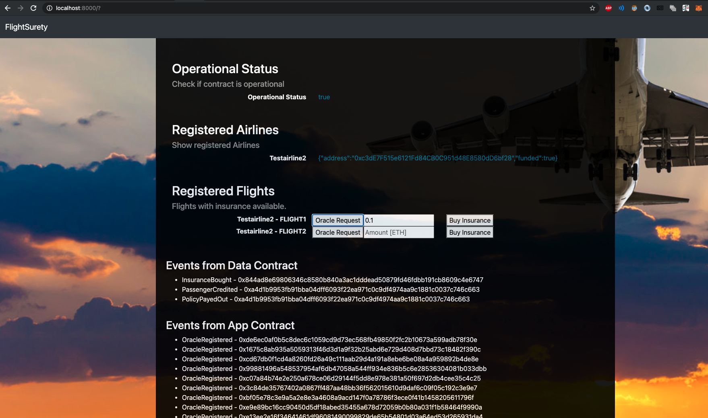

# FlightSurety

FlightSurety is a sample application project for Udacity's Blockchain course.

## Implementation

A few notes on particularities in my implementation:

### Setup
I did a few minor changes in the setup:
- [truffle.js](truffle.js): I switched from using `truffle-hdwallet-provider` to a "normal" provider specification using the hardcoded address
of my local ganache. The original setup lead to a lot of issues in testing when transactions failed (as expected) which lead to transaciton indices being out of sync.
Based on [this](https://github.com/trufflesuite/truffle/issues/2016) github issue using `truffle-hdwallet-provider` in testing seems to be discouraged.
- [contract.js](src/dapp/contract.js): I changed the web3 provider from http to websocket to be able to listen to events.
- *Ganache*: In order to avoid "out of gas" errors I add a lot of gas to many of my transactions. Therefore the gas limit on ganache needs to be adjusted to allow that. I used the following command to start ganache during development / testing `ganache-cli -e 1000 -l 10000000000 -v -a 40`.  (Note that mnemonic does not matter anymore due to above mentioned change in `truffle.js` development network specification)
- [migrations](migrations/2_deploy_contracts.js): I significantly expanded the
  code in the deploy contract migration to include: adding the app contract as
  authorized caller of data contract, registering the first
  airline, funding the first airline, registering a number of test flights to
  be available for insurance.
- *Testing of Oracle Interaction*: To make it easier to test oracle interaction
  in contract unittests I added a function to the app contract that allows me
  to temporarily replace the random index assignment with a deterministic
  version.

### Dapp Ui

My Dapp version has the following UI elements:
- List of registered Airlines: Should normally contain only the one airline that was registered during contract deployment.
- List or registered Flights: List of flights (Airline + flight number) that are registered. Next to each flight there should be a button to fetch the flight status ("Oracle Request") and a text field + button to buy insurance for the requested amount.
- Event Logs: There is one event log for both the data and app contract that should show all events that are emitted while the dapp is running.
- Error Logs: When a transaction (buy insurance / oracle request) returns an error, the error message should be displayed here.

## Install

This repository contains Smart Contract code in Solidity (using Truffle), tests (also using Truffle), dApp scaffolding (using HTML, CSS and JS) and server app scaffolding.

To install, download or clone the repo, then:

`npm install`
`truffle compile`

## Develop Client

To run truffle tests:

`truffle test ./test/flightSurety.js`

To use the dapp:

`truffle migrate`
`npm run dapp`

To view dapp:

`http://localhost:8000`

## Develop Server

`npm run server`
`truffle test ./test/oracles.js`

## Deploy

To build dapp for prod:
`npm run dapp:prod`

Deploy the contents of the ./dapp folder

## Resources

* [How does Ethereum work anyway?](https://medium.com/@preethikasireddy/how-does-ethereum-work-anyway-22d1df506369)
* [BIP39 Mnemonic Generator](https://iancoleman.io/bip39/)
* [Truffle Framework](http://truffleframework.com/)
* [Ganache Local Blockchain](http://truffleframework.com/ganache/)
* [Remix Solidity IDE](https://remix.ethereum.org/)
* [Solidity Language Reference](http://solidity.readthedocs.io/en/v0.4.24/)
* [Ethereum Blockchain Explorer](https://etherscan.io/)
* [Web3Js Reference](https://github.com/ethereum/wiki/wiki/JavaScript-API)
